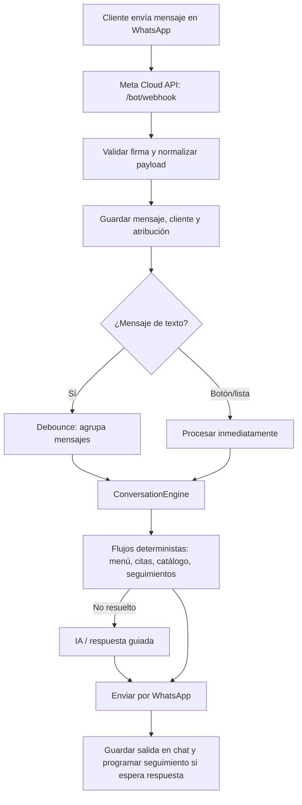

# Flujo actual del bot de Thessa

> Documento técnico-funcional basado en el código actual. Describe lo que el bot hace hoy, no una propuesta futura.

## 1. Vista general



La aplicación es un servicio Node.js/Express. WhatsApp es la entrada y salida; Supabase conserva datos del catálogo, chats, citas y controles. Redis/`StateStore` conserva estado temporal cuando está disponible.

## 2. Inicio de la aplicación

Archivo: `index.js`.

Al iniciar el servidor, además de abrir Express, se activan estos procesos en segundo plano:

| Proceso | Módulo | Frecuencia predeterminada | Función |
| --- | --- | --- | --- |
| Recordatorios de citas | `models/citas/recordatorios.js` | Cada 60 s | Confirmación 2 h antes, aviso 1 h antes, cuidados posteriores y reintentos de Calendar. |
| Seguimiento de servicios | `models/serviceFollowup.js` | Cada 60 s | Recuerda una oferta de servicio que el cliente dejó pendiente. |
| Empujón conversacional | `models/conversationNudgeService.js` | Cada 60 s | Retoma una pregunta, botones o lista sin respuesta. |

Los intervalos se pueden ajustar con variables de entorno:

- `APPOINTMENT_REMINDER_INTERVAL_MS`
- `SERVICE_FOLLOWUP_REMINDER_INTERVAL_MS`
- `CONVERSATION_NUDGE_CHECK_INTERVAL_MS`
- `CONVERSATION_NUDGE_DELAY_MS` (por defecto, 2 minutos)

## 3. Entrada desde WhatsApp

### 3.1 Webhook

| Método | Ruta | Comportamiento |
| --- | --- | --- |
| `GET` | `/bot/webhook` | Meta verifica el webhook con `VERIFY_TOKEN`. |
| `POST` | `/bot/webhook` | Se valida la firma de Meta, se procesa el mensaje y se responde 200. |

El parser (`utils/whatsappWebhookParser.js`) acepta:

- Texto.
- Botones de WhatsApp.
- Respuestas de listas interactivas.

Los demás tipos se contestan con 200, pero no se procesan. El número mexicano `521...` se normaliza a `52...`.

### 3.2 Registro antes de responder

Antes de construir una respuesta, `ConversationEngine.recordIncomingMessage()`:

1. Verifica/crea el cliente y registra atribución de campaña si aplica.
2. Guarda el mensaje entrante en `ChatStore` y Supabase.
3. Guarda o actualiza el nombre del cliente.
4. Intenta reconocer el nombre escrito dentro del mensaje.
5. Cancela cualquier empujón conversacional pendiente para ese número.

### 3.3 Agrupación de mensajes

Los mensajes de texto no se responden uno por uno. `MessageDebouncer` espera 3 s después del último mensaje (`MESSAGE_DEBOUNCE_MS`) y une los textos en una sola consulta. El máximo de espera es 15 s (`MESSAGE_MAX_DEBOUNCE_MS`).

Los clics en botones/listas se procesan de inmediato y antes vacían cualquier texto pendiente. Las respuestas de un mismo número se ejecutan en cola. `ResponseGuard` descarta respuestas que ya quedaron obsoletas por un mensaje más nuevo.

## 4. Orden de decisión de la conversación

Archivo principal: `models/conversationEngine.js`.

Este es el orden efectivo de prioridad una vez que el mensaje llega al motor:

1. **Control humano.** Si el dashboard tomó la conversación (`mode: human`), el bot no responde y deja una alerta para el equipo.
2. **Flujo asistido.** Si el dashboard activó `assisted_flow`, el bot solo intenta continuar la cita. Si no puede, devuelve el control al humano.
3. **Reinicio por menú o saludo.** `menu`, `inicio`, `ayuda`, saludos y la petición de catálogo cancelan el flujo de cita activo y limpian contexto de IA.
4. **Catálogo directo.** `menu_services`, `servicios`, `catálogo` o `tratamientos` muestran categorías.
5. **Registro de promociones.** Si el estado activo es `registro_promociones`, continúa ese formulario.
6. **Cita que ya está en curso.** Si hay estado `agendar_cita`, atiende el siguiente paso de la cita antes de interpretar otra intención.
7. **Gestión de citas.** Procesa payloads de confirmar/cancelar/reprogramar, incluso si el flujo original ya caducó.
8. **Oferta pendiente de un servicio.** Atiende “Agendar cita”, “No gracias”, afirmaciones, negativas u objeciones asociadas al último servicio mostrado.
9. **Consulta prioritaria de servicios.** Solicitudes sobre precios, recomendaciones, promociones o listas del catálogo se resuelven antes del menú guiado.
10. **Menú guiado.** Se revisan los pasos de `helpers/thessaResponses.json`.
11. **Cita no detectada arriba.** Se intenta crear/continuar una cita por texto libre.
12. **Catálogo híbrido.** Se revisan payloads de categoría, servicio o paquete y se detectan consultas del catálogo.
13. **Herramienta de IA activa.** Si la conversación tiene `chatgpt` o `gemini` como herramienta activa, se usa esa IA.
14. **Respuestas guiadas simples.** Actualmente cubre horario de atención.
15. **IA de respaldo.** Si nada anterior resolvió el mensaje, se genera respuesta con IA y se agregan acciones para continuar.

## 5. Menú inicial y flujo guiado

La configuración vive en `helpers/thessaResponses.json` y se ejecuta desde `models/guidedFlowRunner.js`.

Al escribir `hola`, `menu`, `inicio` o `ayuda`, el bot envía tres botones:

| Botón | Payload | Resultado |
| --- | --- | --- |
| Servicios | `menu_services` | Abre catálogo por categorías. |
| Agendar cita | `menu_appointment` | Inicia la selección de una cita. |
| Tengo una duda | `menu_ai` | Activa el contexto de Gemini y pide la pregunta. |

También existen respuestas guiadas para ubicación, horarios, atención humana y gestión de citas. El menú puede cambiarse desde el administrador de flujos; el motor conserva el paso temporal en `StateStore`.

## 6. Catálogo, servicios y paquetes

Módulos principales: `models/catalogMenu.js`, `models/servicesRepository.js`, `models/responseTemplates.js` y `models/serviceFollowup.js`.

### 6.1 Navegación

1. El bot lista categorías con payload `category_<id>`.
2. Al elegir una categoría, lista sus servicios con payload `service_<id>` (máximo 10 por lista).
3. Al elegir un servicio, envía descripción, duración, precio/precios por persona e imagen si existe.
4. Si el servicio tiene paquetes, muestra una lista adicional con payload `package:<serviceId>:<packageId>`.
5. Elegir un paquete inicia la cita con ese paquete y su precio/sesión.

Los productos utilizados de un servicio se guardan en `services.products`, se editan desde el catalogo y entran a la base de conocimiento de la IA. La IA solo debe mencionarlos cuando el cliente pregunte por productos, ingredientes, alergias o sensibilidades.

### 6.2 Consultas por texto

Las reglas detectan primero intención de precio, duración, beneficios, descripción, promociones, disponibilidad o recomendación. Cuando se identifica el servicio, se responde con plantillas del catálogo; no se llama a IA para esos datos exactos.

Para preguntas ambiguas se usa `servicesIntentDetector`:

1. Intenta reglas locales.
2. Si requiere mayor interpretación, clasifica con Gemini (`gemini-2.5-flash` por defecto).
3. Si Gemini no está disponible, intenta OpenAI (`gpt-4o-mini` por defecto).
4. Si ambos fallan, conserva el resultado de reglas.

Las recomendaciones por necesidad (manchas, acné, relajación, flacidez, etc.) usan IA y después se intenta proponer una cita.

### 6.3 Oferta y objeciones

Después de mostrar un servicio o una recomendación, el bot ofrece:

- `Agendar cita` → inicia la cita con el servicio ya elegido.
-N `No gracias` → pregunta el motivo: precio, pensarlo, falta de tiempo o comparación.

Tratamiento de objeciones:

| Motivo | Acción |
| --- | --- |
| Precio | Muestra promociones o servicios de la categoría Promociones. |
| Quiero pensarlo | Envía un mensaje de seguimiento amable. |
| No tengo tiempo | Busca disponibilidad de la semana siguiente. |
| Comparo opciones | Ofrece resolver dudas puntuales. |

Además, se guarda una oferta pendiente localmente en `data/service_followups.json`.

## 7. Dónde entra la IA

Hay tres rutas de IA distintas.

### 7.1 IA de respuesta general: Gemini con DeepSeek de respaldo

Módulo: `models/gemini.js`.

Se usa para dudas libres, recomendaciones, preguntas que no encajan en flujos y preguntas de conocimiento durante una cita.

- Construye una base de conocimiento a partir del catálogo activo.
- Selecciona bloques relevantes según el mensaje.
- Aplica tono de experta de spa y personaliza con el primer nombre del cliente.
- Conserva las últimas cuatro intervenciones en `${phone}:gemini:history` durante 24 h.
- Primero llama a Gemini (`GEMINI_API_KEY` / `GOOGLE_API_KEY`; modelo `GEMINI_MODEL` o `gemini-2.5-flash`).
- Ante cuota, rate limit o configuración ausente intenta DeepSeek (`DEEPSEEK_API_KEY`; `deepseek-chat` por defecto).
- Si no hay proveedor disponible, crea alerta crítica en el chat y envía una sola respuesta avisando que el equipo revisará el caso.
- Tras responder, puede adjuntar medios asociados al texto mediante `utils/serviceMedia`.

### 7.2 IA de clasificación de intención

Módulo: `models/servicesIntentDetector.js`.

No redacta la respuesta; solo devuelve JSON con intención, servicio, problema y dato solicitado. Usa Gemini y, como respaldo, OpenAI.

### 7.3 ChatGPT legado activable por flujo

Módulo: `models/chatgpt.js`.

Un paso guiado puede activar la herramienta `chatgpt`. En ese caso usa OpenAI (`gpt-3.5-turbo`), tono de spa y contexto de 24 h en `${phone}:chatgpt:context`. Este camino no es el respaldo general: se activa solo si el estado `tool` del cliente es `chatgpt`.

## 8. Flujo de citas

Módulos: `models/citas/*`.

```mermaid
flowchart LR
    A[Solicitud de cita] --> B[Extraer datos desde texto y IA]
    B --> C{¿Qué falta?}
    C -->|Servicio| D[Categoría y servicio]
    C -->|Fecha| E[Días disponibles]
    C -->|Hora| F[Horarios disponibles]
    C -->|Personas| G[Validar precio/personas]
    C -->|Nombre(s)| H[Solicitar datos]
    D --> C
    E --> C
    F --> C
    G --> C
    H --> C
    C -->|Completo| I[Validar horario y disponibilidad]
    I --> J[Crear cita pendiente]
    J --> K[Confirmar o cancelar]
```

### 8.1 Creación

La cita puede iniciarse desde el menú, texto libre, una recomendación, un servicio o un paquete.

El sistema obtiene servicio, fecha, hora, personas y nombre desde:

- Payloads de botones/listas.
- Parsers locales.
- Extractor con IA para datos de cita.

Después pregunta el dato faltante: servicio, fecha, hora, número de personas, nombres de participantes o nombre de la reserva. Los precios por personas se validan contra la configuración del servicio.

Antes de guardar, verifica que el horario no haya pasado, esté dentro del horario laboral y esté libre. Usa Google Calendar cuando está configurado; si no logra crear/consultar Calendar, puede registrar la cita con fuente `local-calendar-fallback`.

La nueva cita queda con estado `pendiente`, se almacena y se manda un mensaje de resumen con botones `Confirmo` y `Cancelar`. Si hay Calendar disponible, crea el evento.

### 8.2 Confirmación, cancelación y reprogramación

- **Confirmar:** cambia el estado a `confirmada`, actualiza Calendar, manda liga de Google Calendar e invitación `.ics` si existe `PUBLIC_BASE_URL`, envía cuidados previos del servicio e inicia el registro de promociones si faltan datos.
- **Cancelar:** marca la cita como `cancelada`, intenta eliminar el evento de Calendar y conserva un estado `pending-delete` para reintentar si falla.
- **Reprogramar:** permite elegir cita, día y hora; valida disponibilidad, actualiza el evento y vuelve a pedir confirmación.
- **Gestionar citas:** una persona puede pedir “mis citas”, “gestionar cita”, “reprogramar”, “cancelar” o “confirmar”. Si tiene varias, elige cuál; si tiene una, ve directamente al menú de acciones.

Durante una cita, una pregunta de conocimiento que no parezca dato de la cita se puede delegar temporalmente a la IA sin abandonar el flujo.

### 8.3 Promociones al confirmar

Después de confirmar una cita, `promoFlow` revisa el perfil. Si faltan fecha de cumpleaños o correo, pregunta si acepta registrarse y solicita solo lo que falte. Los datos se guardan en el cliente. Si rechaza, limpia el estado.

## 9. Recordatorios y seguimientos automáticos

### 9.1 Citas

`models/citas/recordatorios.js` revisa citas activas (`pendiente` o `confirmada`) y evita envíos duplicados mediante campos en `appointment.reminders`.

| Momento | Condición | Mensaje/acción |
| --- | --- | --- |
| Entre 2 h y 1 h antes | Cita pendiente, sin `confirmation2hSentAt` | Pide confirmar o cancelar con botones. |
| Dentro de la última hora | Cita pendiente o confirmada, sin `reminder1hSentAt` | Envía recordatorio de texto. No se envía si la cita se creó dentro de esa misma hora. |
| Al terminar la cita | Cita confirmada y venció `postAppointmentCareDueAt` | Envía cuidados posteriores configurados para el servicio. |
| En cada revisión | Hay cancelación de Calendar pendiente | Reintenta borrar el evento. |

### 9.2 Seguimiento de servicio

Al mostrar un servicio, se agenda un seguimiento en `data/service_followups.json`. Si sigue en `awaiting_response` cuando llega `SERVICE_FOLLOWUP_REMINDER_DELAY_MS` (mínimo 1 minuto; el valor predeterminado se define en el módulo), se envía un solo recordatorio para ayudar a reservar. Se cancela/actualiza cuando el cliente agenda, rechaza o elige un motivo.

### 9.3 Empujón conversacional

Cada salida del bot puede agendar una reanudación si:

- Es una pregunta de texto, o
- Es un mensaje interactivo de botones o lista.

No se agenda para mensajes humanos ni para otros empujones. Si el cliente escribe de nuevo, se cancela. Cuando vence, el bot puede reenviar la interacción con “¿Te gustaría continuar?” o repetir la pregunta usando el mensaje configurable `conversation_nudge`.

Las acciones de cierre de cita/servicio no se reenvían como botones para evitar confirmar o cancelar una acción de forma accidental.

## 10. Salida por WhatsApp y trazabilidad

Todo envío central pasa por `models/messages.js`:

1. Verifica con `ResponseGuard` que no sea una respuesta vieja.
2. Personaliza textos con el nombre del cliente, salvo que se indique `personalize: false`.
3. Construye el payload de Meta para texto, imagen, audio, documento, video, contacto, ubicación, listas o botones.
4. Lo publica en la API de WhatsApp Cloud.
5. Guarda la salida en `ChatStore`/Supabase para el dashboard.
6. Marca al lead como contactado en el embudo de marketing, cuando hay atribución de campaña.
7. Programa el empujón conversacional cuando corresponde.

Los eventos de campaña también pueden registrar cita creada y cita confirmada como etapas del embudo.

## 11. Estado y persistencia

| Información | Ubicación principal | Uso |
| --- | --- | --- |
| Catálogo, categorías, precios, paquetes, beneficios y productos utilizados | Supabase (`services`, tablas relacionadas) | Consultas, catálogo, administración y base de conocimiento de IA. |
| Mensajes y alertas de chat | `ChatStore` / Supabase | Dashboard y auditoría. |
| Citas y flujos de cita | Almacenamiento de citas (Supabase con respaldo local) | Reserva, confirmación, reprogramación y recordatorios. |
| Estado corto de conversación y herramientas IA | `StateStore`/Redis | Pasos guiados, contexto, debounce, nudges y herramientas activas. |
| Control humano | Supabase `conversation_controls`, con respaldo en memoria | Pausa del bot y flujo asistido. |
| Seguimiento de servicios | `data/service_followups.json` | Oferta pendiente y recordatorio de servicio. |

## 12. Configuración y dependencias externas

| Integración | Uso en el flujo |
| --- | --- |
| Meta WhatsApp Cloud API | Recibir webhook y enviar mensajes. |
| Supabase | Catálogo, chats, datos de clientes, controles y datos persistentes. |
| Redis / StateStore | Estado de corta duración; el proyecto mantiene alternativas locales según módulo. |
| Google Calendar | Disponibilidad, creación, actualización y cancelación de eventos. |
| Gemini | IA principal de respuesta y clasificación. |
| DeepSeek | Respaldo de la IA de respuesta. |
| OpenAI | Respaldo de clasificación y herramienta ChatGPT activable por flujo. |

## 13. Puntos importantes para operación

- El catálogo no disponible se responde con un mensaje seguro en vez de inventar información.
- La IA recibe una base de conocimiento del catálogo, incluyendo los productos utilizados por cada servicio cuando estén registrados.
- Los recordatorios dependen de que la instancia Node permanezca ejecutándose; no son tareas de Supabase.
- Los mensajes de entrada se responden 200 aun si falla un error no crítico de proceso, para no provocar reintentos agresivos de Meta.
- Si no hay IA disponible, el dashboard muestra una alerta para que el equipo tome la conversación.
- Tomar una conversación desde el dashboard detiene las respuestas automáticas hasta liberar el control.
